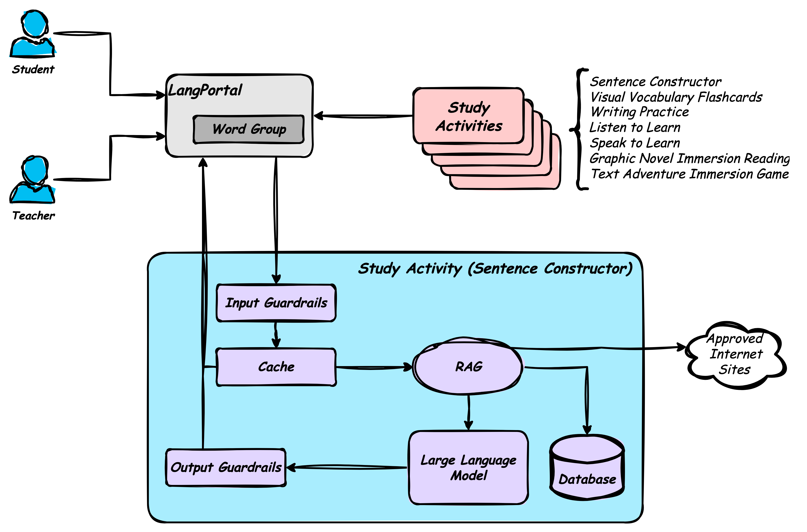

# Conceptual Design

The following diagram describes the primary functional perspective of the conceptual design. It elaborates the Sentence Constructor Study Activity available to students in the SprachPortal.

## Actors

The Student and Teacher both access the Study Activities through the LangPortal (SprachPortal). The portal presents the Study Activities for the students to practice, and for the teachers to assess and validate the content.

## LangPortal

The LangPortal provides the main interface for the students and teachers to access the various Study Activities. Once presented to the users (students or teachers), the user works directly with the Study Activity. The Activity is basically embedded in the browser page or presented modally in the browser.

## Study Activities

### SentenceConstructor

In the Sentence Constructor activity, the student can request that the activity provide sentences on any topic within the guardrails of the system.

When the student makes a request (a prompt) to the system, the **Input Guardrails** that the input is acceptable. If the prompt is not accessible (for example, asks for inappropriate content), the student is told their prompt is invalid asked to enter another prompt.

If accepted, the prompt is passed to the **Cache** to see if data has already been retrieved, and returns anything available to the student.

After the **Cache** check, the prompt goes to the **Retrieval Augmented Generation** function that checks the local word and sentence **Database**. If the appropriate words and translations are not in the database, the **RAG** function can connect to approved content sites to retrieve and construct example sentences.

Once the RAG has collected the appropriate content and words, it passes the prompt and other data to the **Large Language Model** to construct sentences for the student to translate. The student enters their attempted translation and the system checks the translation against the translation in the Large Language Model. The Sentence Constructor provides guidance to the student on how to create the sentence in German.

All responses to the student pass through the **Output Guardrails** to make sure no inappropriate content is sent back to the student.
