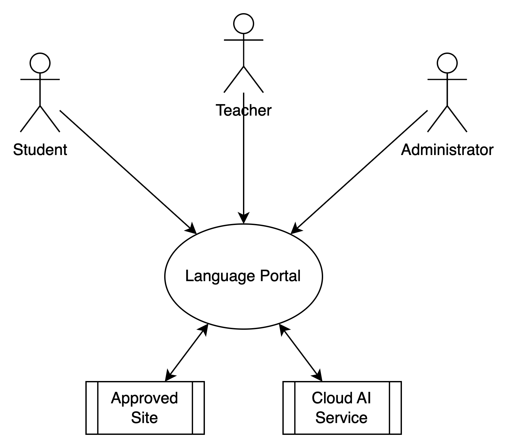

# System Context

## System Diagram

## System Description

The Language Portal contains all of the system components necessary for the Language Portal application.

### Actors

#### Human Actors

##### Student

The Student actor interacts with the system through a web browser to perform the following functions:
- Account registration
- Account management (profile updates, security settings, account deletion, etc)
- Student activities and assignments

##### Teacher

The Teacher actor interacts with the system through a web browser to perform the following functions:
- Account registration
- Account management (profile updates, security settings, account deletion, etc)
- Teacher to student assignments
- Student activity assignments and assessment
- Student proficiency review
- Student activity content creation and verification

##### Adminsitrator

The Administrator actor encompasses multiple roles and functions. The administrators access the system through the appropriate administrator interfaces.
- System Administrator
  - Manage the physical and virtual environments, infrastructure
  - Manage application deployment
  - Perform system support
  - Configure connections to external Generative AI services
- Database Administrator
  - Manage any databases within the system
- Content Manager
  - Manage content approval for the system

#### System Actors

##### Approved Site

The Language Portal can retrieve content from Approved internet sites to build content for the student activities. The system will only connect to sites on the approved list for content retrieval.

##### Cloud AI Service

The system may need to augment its Generative AI capabilities with those of an external cloud service or Application Programming Interface (API).
