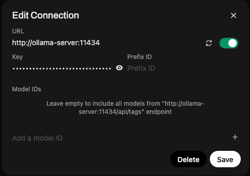
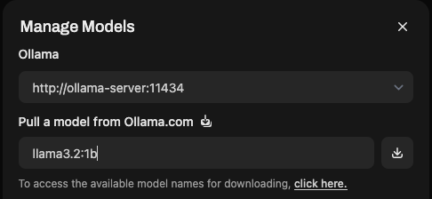
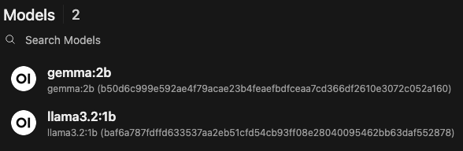
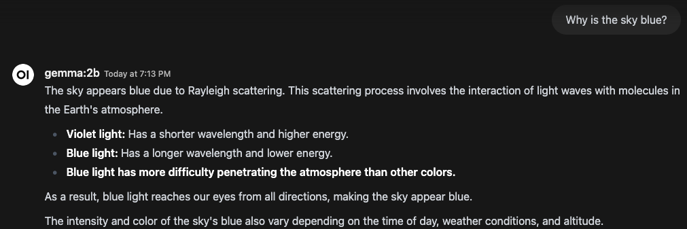

# Running Multiple OPEA Comps on MacOS using Docker Desktop

## Prerequisites

- Docker Desktop
- OPEA Comps

## Steps

1. Open Docker Desktop
    - The starts the Docker engine on the Mac
    - Make sure the `docker context` is pointing to the correct Docker engine
        - Best to use the unprivileged docker engine with Docker Desktop, so the Docker Endpoint will look like this: `unix:///Users/<username>/.docker/run/docker.sock`

### Create docker-compose.yml

```yaml
services:
  ollama-server:
    image: ollama/ollama
    container_name: ollama-server
    ports:
      - ${LLM_ENDPOINT_PORT:-8008}:11434
    environment:
      no_proxy: ${no_proxy}
      http_proxy: ${http_proxy}
      https_proxy: ${https_proxy}
      LLM_MODEL_ID: ${LLM_MODEL_ID}
      host_ip: ${host_ip}

networks:
  default:
    driver: bridge
```

```sh
LLM_ENDPOINT_PORT=8008 host_ip=`ipconfig getifaddr en1` LLM_MODEL_ID="llama3.2:1b" docker compose up
```

### Install a model in server

*If this isn't done, the ollama-server reports there are no models.*

From [ollama GitHub page](https://github.com/ollama/ollama/blob/main/docs/docker.md) about Docker.

Message when there are no models:

```error
curl http://localhost:8008/api/ps
{"models":[]}%
```

Install the `llama3.2:1b` model in ollama-server:

```sh
docker exec -it ollama-server ollama run llama3.2:1b
```

Response:

```text
pulling manifest
pulling 74701a8c35f6... 100% ▕████████████████████████████████████████████████████████▏ 1.3 GB
pulling 966de95ca8a6... 100% ▕████████████████████████████████████████████████████████▏ 1.4 KB
pulling fcc5a6bec9da... 100% ▕████████████████████████████████████████████████████████▏ 7.7 KB
pulling a70ff7e570d9... 100% ▕████████████████████████████████████████████████████████▏ 6.0 KB
pulling 4f659a1e86d7... 100% ▕████████████████████████████████████████████████████████▏  485 B
verifying sha256 digest
writing manifest
success
>>> Send a message (/? for help)
```

**Correct** response after installing the model to ollama-server:

```text
curl http://localhost:8008/api/ps
{"models":[{"name":"llama3.2:1b","model":"llama3.2:1b","size":2233526272,"digest":"baf6a787fdffd633537aa2eb51cfd54cb93ff08e28040095462bb63daf552878","details":{"parent_model":"","format":"gguf","family":"llama","families":["llama"],"parameter_size":"1.2B","quantization_level":"Q8_0"},"expires_at":"2025-02-16T20:08:45.193838343Z","size_vram":0}]}% 
```

### Test to see if Llama is working

```text
>>> why is the sky blue?
The sky appears blue to us because of a phenomenon called Rayleigh scattering, named after the British physicist
Lord Rayleigh. He discovered that when sunlight enters Earth's atmosphere, it encounters tiny molecules of gases
such as nitrogen and oxygen.

These gas molecules are much smaller than the wavelength of light, which is the distance between two consecutive
peaks or troughs in a wave. As a result, these small molecules scatter the shorter (blue) wavelengths of light
more efficiently than the longer (red) wavelengths.

This scattering effect gives the sky its blue color. The amount of scattering that occurs depends on the altitude
at which the light reaches us and the concentration of atmospheric gases. At higher altitudes, where the air is
thinner, more blue light is scattered, making the sky appear bluer. Conversely, at lower altitudes, more red light
is scattered, giving the sky a reddish hue.

It's worth noting that during sunrise and sunset, the angle of the sunlight is such that it hits the atmosphere at
an angle, which causes even more scattering of shorter wavelengths (like blue and violet). This is why these times
of day can produce spectacular displays of colorful light in the sky.
```

### Try using the API

```sh
curl --noproxy "*" http://localhost:8008/api/generate -d '{
  "model": "llama3.2:1b",
  "prompt":"Why is the sky blue?"
}'
```

It should return the same text in chunks as the direct query in the prompt.

### Pull a model using the API

```sh
curl --noproxy "*" http://localhost:8008/api/pull -d '{
  "model": "gemma:2b"
}'
```

Test the model with docker exec

```sh
docker exec -it ollama-server ollama run gemma:2b
```

Response:

```text
>>> why is the sky blue?
The sky appears blue due to a phenomenon called **Rayleigh scattering**. This scattering process involves the
interaction of light with molecules in the Earth's atmosphere. Here's a breakdown of the process:

1. **Sun's light:** The sun emits all colors of the spectrum (red, orange, yellow, green, blue, indigo, and
violet), each with different wavelengths having varying amounts of energy.
2. **Atmosphere:** As sunlight enters Earth's atmosphere, it interacts with the molecules of different gases.
3. **Scattering:** The blue and violet light have shorter wavelengths and higher energy compared to the longer
wavelengths like red and orange.
4. **Scattering pattern:** These shorter blue and violet light waves are scattered more efficiently than the
longer red and orange light.
5. **Blue light dominant:** This scattering pattern results in a higher concentration of blue and violet light in
the sky, giving us the perception of a blue color.

Therefore, the blue color of the sky is a result of Rayleigh scattering, which is why the sky appears blue.
```

Test the model with API:

```sh
curl --noproxy "*" http://localhost:8008/api/generate -d '{                                         49s free-genai-bootcamp-2025
  "model": "gemma:2b",   
  "prompt":"Why is the sky blue?"
}'
```

## Technical Uncertainty

How to get a model running on a late-2013 iMac without a big GPU? Use Docker with small language models, like Llama 3.2 (1b) and Gemma (2b) will work, but they are not fast.

Will it run? Small language models in the 0.5-2 billion parameter range seem to run. I have tried a 7 billion parameter model before the bootcamp and my iMac went out to lunch.

Can we run it using Docker Desktop in a container? Yes! In fact, we can run multiple models within the same container.

Once it's running, how can we connect to it? We can connect directly to the language model using the API (/api/generate -d {payload}) or `docker exec -it` commands.

How can we get a front-end for it to hide the API calls?

Can we pull multiple models? Yes, we can pull models either through the API (/api/pull -d) or using `docker exec -it` commands.

## Models

Need to use small models because of system limitations.

- [Llama3.2:1b](https://ollama.com/library/llama3.2:1b)
- [gemma:2b](https://ollama.com/library/gemma:2b)

## Notes

Gemma:2b was much faster than Llama3.2:1b using the API, and was more concise.

## Setting up WebUI for Ollama-Server via Docker

Since I'm not a programmer, want to see if I can setup WebUI and connect to Ollama-Server container.

### Docker Compose

```yaml
services:
  ollama-server:
    image: ollama/ollama
    container_name: ollama-server
    ports:
      - ${LLM_ENDPOINT_PORT:-8008}:11434
    environment:
      no_proxy: ${no_proxy}
      http_proxy: ${http_proxy}
      https_proxy: ${https_proxy}
      LLM_MODEL_ID: ${LLM_MODEL_ID}
      host_ip: ${host_ip}
    volumes:
      - ollama-data:/root/.ollama

  webui:
    image: ghcr.io/open-webui/open-webui:main
    ports:
      - "3000:8080"
    volumes:
      - open-webui:/app/backend/data

volumes:
  open-webui:
  ollama-data:

networks:
  default:
    driver: bridge
```

**Note:** by using named volumes, the storage will persist between `docker compose down` and `docker compose up`, even though the containers themselves are removed from Docker.

### Setting up WebUI

After logging in (first account is admin account), go to Admin Panel -> Settings -> Connections

Click the settings icon to the right of **Manage Ollama API Connections**.

- **URL:** Set to the Docker server name and private port, not the published port.
- **Key:** Put in the API key for Ollama-Server



### Download Models using WebUI

Go to Admin Panel -> Settings -> Models and click the Manage Modules icon (looks like a download icon).

Enter the Model name and click Download button.
- llama3.2:1b
- gemma:2b



Active Models:



Working Chat results:



## Setting up Mega-Service

### Installing python modules

```sh
uv pip install opea-comps
```

Installs multiple packages

```text
Resolved 93 packages in 2.85s
      Built docx2txt==0.8
Prepared 91 packages in 3.95s
Installed 91 packages in 369ms
 + aiofiles==24.1.0
 + aiohappyeyeballs==2.4.6
 + aiohttp==3.11.11
 + aiosignal==1.3.2
 + annotated-types==0.7.0
 + anyio==4.8.0
 + async-timeout==4.0.3
 + attrs==25.1.0
 + cachetools==5.5.1
 + certifi==2025.1.31
 + charset-normalizer==3.4.1
 + dataclasses-json==0.6.7
 + deprecated==1.2.18
 + docarray==0.40.0
 + docx2txt==0.8
 + durationpy==0.9
 + fastapi==0.115.7
 + frozenlist==1.5.0
 + google-auth==2.38.0
 + googleapis-common-protos==1.67.0
 + greenlet==3.1.1
 + grpcio==1.70.0
 + h11==0.14.0
 + httpcore==1.0.7
 + httpx==0.28.1
 + httpx-sse==0.4.0
 + idna==3.10
 + importlib-metadata==8.5.0
 + jsonpatch==1.33
 + jsonpointer==3.0.0
 + kubernetes==32.0.0
 + langchain==0.3.15
 + langchain-community==0.3.15
 + langchain-core==0.3.35
 + langchain-text-splitters==0.3.6
 + langsmith==0.3.8
 + markdown-it-py==3.0.0
 + marshmallow==3.26.1
 + mdurl==0.1.2
 + multidict==6.1.0
 + mypy-extensions==1.0.0
 + numpy==1.26.4
 + oauthlib==3.2.2
 + opea-comps==1.2
 + opentelemetry-api==1.29.0
 + opentelemetry-exporter-otlp==1.29.0
 + opentelemetry-exporter-otlp-proto-common==1.29.0
 + opentelemetry-exporter-otlp-proto-grpc==1.29.0
 + opentelemetry-exporter-otlp-proto-http==1.29.0
 + opentelemetry-proto==1.29.0
 + opentelemetry-sdk==1.29.0
 + opentelemetry-semantic-conventions==0.50b0
 + orjson==3.10.15
 + packaging==24.2
 + pillow==11.1.0
 + prometheus-client==0.21.1
 + prometheus-fastapi-instrumentator==7.0.2
 + propcache==0.2.1
 + protobuf==5.29.3
 + pyasn1==0.6.1
 + pyasn1-modules==0.4.1
 + pydantic==2.10.6
 + pydantic-core==2.27.2
 + pydantic-settings==2.7.1
 + pygments==2.19.1
 + pypdf==5.1.0
 + python-dateutil==2.9.0.post0
 + python-dotenv==1.0.1
 + python-multipart==0.0.20
 + pyyaml==6.0.2
 + requests==2.32.3
 + requests-oauthlib==2.0.0
 + requests-toolbelt==1.0.0
 + rich==13.9.4
 + rsa==4.9
 + shortuuid==1.0.13
 + six==1.17.0
 + sniffio==1.3.1
 + sqlalchemy==2.0.38
 + starlette==0.45.3
 + tenacity==9.0.0
 + types-requests==2.32.0.20241016
 + typing-extensions==4.12.2
 + typing-inspect==0.9.0
 + urllib3==2.3.0
 + uvicorn==0.34.0
 + websocket-client==1.8.0
 + wrapt==1.17.2
 + yarl==1.18.3
 + zipp==3.21.0
 + zstandard==0.23.0
```

### Create code

Start with [OPEA MegaService example](https://opea-project.github.io/latest/GenAIComps/README.html#megaservice)


